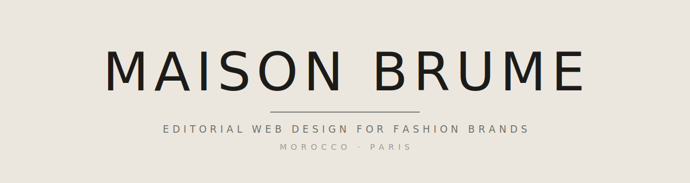

<p align="center">
  <picture>
    <source media="(prefers-color-scheme: dark)" srcset="assets-readme/hero-banner-dark.svg" />
    
  </picture>
</p>

<p align="center">
  <a href="https://github.com/hatimhtm/maison-brume-site/actions/workflows/deploy.yml"></a>
  <a href="https://hatimhtm.github.io/maison-brume-site/"></a>
  
  
  
  
  
  
  
  
</p>

<p align="center">
  <em>The studio's <strong>own</strong> site — <strong>Maison Brume</strong>, an editorial web-design studio for fashion brands, Morocco · Paris. <strong>Astro 5 + Tailwind v4</strong>, restrained editorial system (Fraunces optical axes, warm-mono palette), a deferred <strong>WebGL "brume"</strong> mist hero, <strong>CSS-only</strong> entrance (no JS/scroll gate — content can never hide itself), <strong>French-default</strong> browser detection with a persisted explicit choice, real client screenshots as the work. 21 static pages, near-zero JS on mobile, auto-deploys to <strong>GitHub Pages</strong> with zero config and zero cost.</em>
</p>

---

### `/// THE BRIEF`

A studio that sells web design has to *be* its own best argument. The brief, set against the conversion funnel, not taste:

1. **Restraint, not austerity** — quiet-luxury editorial (The Row / Aesop register), but carried by the actual work shown, never bare type.
2. **Mobile is the audience** — Morocco/France brand owners on phones. Sub-2s, 60fps, near-zero JS. The flex is craft, not a WebGL circus.
3. **Prove it by showing** — real screenshots of five live client/concept sites are the portfolio; each case is a story in plain language, not jargon.
4. **French-first** — most prospects browse in French; the default is FR unless the browser's primary language is English. An explicit language choice is remembered and never overridden.
5. **Free + ownable** — pure static, GitHub Pages, no runtime deps, no lock-in. Custom domain swaps in via env when a client engagement justifies it.

---

### `/// SECTIONS`

```
┌────────────────────────────────────────────────────────────────┐
│ Nav — MB mark · Work · Services · Studio · WhatsApp · EN/FR     │
├────────────────────────────────────────────────────────────────┤
│ Hero — deferred WebGL brume (drifting mist), problem-first      │
│   headline grounded at baseline, prefilled-WhatsApp CTA         │
├────────────────────────────────────────────────────────────────┤
│ Manifesto — the point of view ("Most fashion sites betray…")    │
├────────────────────────────────────────────────────────────────┤
│ Selected Work — 5 real sites, image-led, proof-first order      │
├────────────────────────────────────────────────────────────────┤
│ What I build — services teaser → /services                     │
├────────────────────────────────────────────────────────────────┤
│ How it begins — the proof-first offer (concept before contract) │
├────────────────────────────────────────────────────────────────┤
│ How it works — 4-step process (Study · Concept · Build · Yours) │
├────────────────────────────────────────────────────────────────┤
│ Close — a real ending + prefilled WhatsApp                      │
├────────────────────────────────────────────────────────────────┤
│ Footer — mark · nav · WhatsApp · email                          │
└────────────────────────────────────────────────────────────────┘

Routes (×2 locales, EN at root · FR under /fr)
  /  ·  /work  ·  /work/[5 cases]  ·  /services  ·  /studio
  /contact  ·  404                              → 21 static pages
```

---

### `/// HIGHLIGHTS`

| | |
|---|---|
| **CSS-only entrance — content can never hide itself** | Reveal/clip/scale live *only* inside `@keyframes` with `animation-fill-mode: both`, guarded by `prefers-reduced-motion`. No JS, no IntersectionObserver, no scroll gate. A prior JS-gated version could leave every image invisible on a slow phone or a screenshot — that class of bug is now structurally impossible. |
| **Deferred WebGL "brume"** | Hand-written GLSL fbm mist behind the hero — the studio's name, made literal. Raw WebGL, no library, `requestIdleCallback`-lazy, DPR-capped, paused off-screen/hidden, skipped on reduced-motion or no-WebGL. Zero first-paint cost; the page is fully usable without it. |
| **French-default i18n, no server** | An inline `<head>` script (EN pages only) redirects to the FR equivalent unless the browser's primary language is English. An explicit switch writes `localStorage` and is **never** overridden — no one is trapped. Pure static; works on GitHub Pages. |
| **Restrained design system** | One fluid type scale, Fraunces variable axes (`opsz`/`SOFT`/`WONK`) set per use, warm-mono palette (WCAG-AA), one easing everywhere, a subliminal SVG grain layer, an SVG maker's-mark ornament. No template tells. |
| **Real work, real screenshots** | Five live client/concept sites captured, optimised, shown image-led with full-page scroll-throughs on each case page, plus a plain-language "in plain terms" outcome — honestly labelled (prototype / concept / shipped to production). |
| **Mobile-first budget** | Near-zero JS (Lenis loads only on fine-pointer + motion-allowed; brume only on capable devices). Tailwind v4, inlined CSS, static output. Sub-2s on mid-range phones. |
| **GitHub Pages, base-path-correct** | `site`/`base` env-driven, every internal link + asset base-aware, trailing-slash aligned to directory output, `.nojekyll` shipped, Actions deploy. Custom domain = two env vars when the time comes. |

---

### `/// I18N`

| Locale | Path | Default for | Notes |
|---|---|---|---|
| `fr` | `/fr/...` | **Everyone except English browsers** | Transcreated (luxury cadence, not literal). "Maison Brume" stays a proper noun; generic "maison" → marque/activité |
| `en` | `/` (root) | Browsers whose primary language is English | Authored copy; problem-first voice |

Detection runs before paint, in `<head>`, EN pages only. Explicit choice (`localStorage: mb-lang`) wins forever. FR pages carry no redirect logic — zero loops.

---

### `/// STACK`

```
Astro 5                      · static output, i18n routing
Tailwind v4 (@tailwindcss/vite) · design tokens via @theme
TypeScript (strict)          · astro/tsconfigs/strict
Fraunces + Schibsted Grotesk · @fontsource-variable, latin
Lenis 1.1                    · smooth scroll (fine-pointer only)
Raw WebGL + GLSL             · the brume mist, no library
Inline SVG                   · ornament · grain · banners
```

No UI kit. No chart/animation libraries. CDN-free — fonts self-hosted via Fontsource.

---

### `/// PROJECT LAYOUT`

```
.
├── astro.config.mjs           site/base env-driven · i18n · Tailwind v4 vite
├── src/
│   ├── lib/
│   │   ├── content.ts         single source of all copy (EN + FR) + waLink
│   │   └── paths.ts           base/locale-aware url + asset helpers
│   ├── layouts/Base.astro     head · FR-default detector · skip-link · Lenis
│   ├── components/            Nav · Footer · Mark · Ornament · BrumeFog
│   │                          Home · WorkIndex · CaseStudy · Services
│   │                          Studio · Contact
│   ├── pages/                 index · work · work/[slug] · services
│   │   └── fr/                studio · contact · 404   (mirrored under /fr)
│   └── styles/global.css      design system — tokens, type, motion, grain
├── public/
│   ├── work/                  5 site screenshots + full-page scroll-throughs
│   └── .nojekyll
├── assets-readme/             this README's hero (light · dark)
├── .github/workflows/deploy.yml   withastro/action → Pages
└── README.md
```

---

### `/// LOCAL DEV`

```bash
npm install
npm run dev        # http://localhost:4321
npm run build      # static output → dist/
npm run preview    # serve the build
```

No external services. The contact path is WhatsApp-first (prefilled deep links) — no backend, no form server.

---

### `/// DEPLOY`

```
push to main → .github/workflows/deploy.yml (withastro/action)
            → builds, injects .nojekyll, uploads Pages artifact
            → https://hatimhtm.github.io/maison-brume-site/
```

Custom domain later: set repo variables `SITE_URL` + `BASE_PATH` (empty), add `public/CNAME`. No code change.

---

### `/// CHECKS`

```bash
npx astro check    # 0 errors · 0 warnings · 0 hints
npm run build      # 21 pages, clean
```

Verification is done by inspecting built output / a cache-busted screenshot — never by HTTP status alone. (Learned the hard way; written down so it stays learned.)

---

<p align="center"><sub>© Maison Brume — studio site. MIT licensed. Built in the open.</sub></p>
